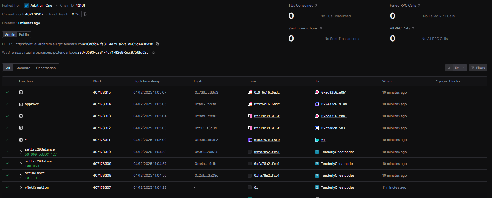
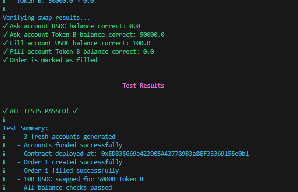

# CustomOrderBook - Decentralized Order Book Exchange

A security-hardened, decentralized exchange (DEX) implementation featuring an on-chain order book system for trustless ERC20 token swaps on EVM-compatible blockchains.




## Overview


CustomDex provides a fully decentralized order book system where users can:

- Create limit orders to exchange any ERC20 token pair at specified rates
- Fill existing orders atomically without intermediaries
- Cancel unfilled orders and recover deposited tokens
- Trade trustlessly with automatic token custody and settlement

The system is designed with security as a priority, implementing reentrancy protection, Checks-Effects-Interactions pattern, and SafeERC20 token transfers.

## Key Features

### Smart Contract

- **Universal ERC20 Support**: Trade any ERC20 token pair
- **Atomic Swaps**: Orders are filled completely or not at all
- **Security Hardened**: Version 1.1 with reentrancy guards and SafeERC20
- **Gas Optimized**: Efficient storage patterns and batch queries
- **Owner Controls**: Emergency withdrawal and ownership transfer functions
- **Event Logging**: Comprehensive event emissions for off-chain tracking

## Architecture

```text
CustomDex/
├── src/
│   ├── contracts/
│   │   └── OrderBook.sol           # Main order book smart contract
│   ├── deploy/
│   │   ├── deploy_orderbook.py     # Deployment automation script
│   │   ├── deployment_config.json  # Network configurations
│   │   ├── .env.example            # Environment template
│   │   └── requirements.txt        # Python dependencies
│   └── test/
│       ├── test_orderbook.py       # Integration test suite
│       ├── example_usage.py        # Usage examples
│       ├── README.md               # Testing documentation
│       └── utils/                  # Testing utilities
├── deployments/                    # Deployment artifacts (ABIs, addresses)
└── README.md                       # This file
```

## Prerequisites

### Development Environment

- **Node.js** (v16+) and npm
- **Python** 3.8 or higher
- **Solidity** 0.8.20 (automatically installed by deployment script)

### Blockchain Access

- RPC endpoint for target network (Infura, Alchemy, Tenderly, etc.)
- Wallet with native tokens for gas fees
- Private key for deployment (keep secure!)

## Installation

### **Clone the repository**

```bash
git clone https://github.com/agorevski/CustomDex.git
cd CustomDex
```

### **Install OpenZeppelin contracts**

```bash
npm install @openzeppelin/contracts
```

### **Install Python dependencies**

```bash
cd src/deploy
pip install -r requirements.txt
```

### **Configure environment**

```bash
cp src/deploy/.env.example src/deploy/.env
# Edit .env and add your PRIVATE_KEY
```

## Quick Start

### 1. Deploy the Contract

Edit `src/deploy/deployment_config.json` to configure your target network, then deploy:

```bash
cd src/deploy
python deploy_orderbook.py --network tenderly
```

The deployment script will:

- Compile the OrderBook contract
- Deploy to your specified network
- Save deployment artifacts to `deployments/`
- Verify the deployment

### 2. Interact with the Contract

Use the Python Web3 library or any Web3-compatible tool:

```python
from web3 import Web3
import json

# Connect to network
w3 = Web3(Web3.HTTPProvider('YOUR_RPC_URL'))

# Load contract
with open('deployments/OrderBook_abi.json') as f:
    abi = json.load(f)
contract = w3.eth.contract(address='CONTRACT_ADDRESS', abi=abi)

# Create an order (must approve tokens first)
tx = contract.functions.createOrder(
    token_a_address,  # Token to offer
    1000000,          # Amount to offer
    token_b_address,  # Token to request
    2000000           # Amount to request
).transact({'from': your_address})
```

### 3. Run Tests

```bash
cd src/test
python test_orderbook.py
```

See `src/test/README.md` for detailed testing documentation.

## Usage Examples

### Creating an Order

```solidity
// 1. Approve the OrderBook contract to spend your tokens
IERC20(tokenA).approve(orderBookAddress, amountToOffer);

// 2. Create the order
uint256 orderId = orderBook.createOrder(
    tokenA,           // Token you're offering
    100 * 10**6,      // Amount you're offering (100 USDC with 6 decimals)
    tokenB,           // Token you want
    50000 * 10**6,    // Amount you want (50,000 Token B with 6 decimals)
);
```

### Filling an Order

```solidity
// 1. Approve the OrderBook contract to spend your tokens
IERC20(tokenB).approve(orderBookAddress, amountRequested);

// 2. Fill the order
orderBook.fillOrder(orderId);
```

### Canceling an Order

```solidity
// Only the order maker can cancel
orderBook.cancelOrder(orderId);
```

### Querying Orders

```solidity
// Get specific order details
Order memory order = orderBook.getOrder(orderId);

// Get all orders for a user
uint256[] memory userOrderIds = orderBook.getUserOrders(userAddress);

// Get active orders (paginated)
Order[] memory activeOrders = orderBook.getActiveOrders(1, 100);
```

## Security Considerations

### ⚠️ Important Warnings

1. **Fee-on-Transfer Tokens Not Supported**
   - Do NOT use tokens that deduct fees during transfers (e.g., some USDT implementations, reflection tokens)
   - These will cause orders to become stuck and unfillable
   - The contract validates exact amounts and will fail with fee-on-transfer tokens

2. **Token Approvals**
   - Always approve the exact amount needed before creating or filling orders
   - Revoke approvals after trading to minimize risk

3. **Private Keys**
   - NEVER commit private keys to version control
   - Use environment variables or secure key management systems
   - Test wallets should only contain testnet funds

### Security Features

- **ReentrancyGuard**: Prevents reentrancy attacks on all state-changing functions
- **Checks-Effects-Interactions**: Follows CEI pattern to prevent vulnerabilities
- **SafeERC20**: Uses OpenZeppelin's SafeERC20 for secure token transfers
- **Input Validation**: Comprehensive validation of all parameters
- **Emergency Controls**: Owner can withdraw stuck funds in emergencies

## Deployment Configuration

Edit `src/deploy/deployment_config.json` to add or modify networks:

```json
{
  "network_name": {
    "rpc_url": "https://your-rpc-endpoint.com",
    "chain_id": 1,
    "gas_price": "auto",
    "gas_limit": 5000000
  }
}
```

Supported networks include:

- Ethereum Mainnet & Sepolia testnet
- Polygon & Mumbai testnet
- Arbitrum
- Tenderly Virtual TestNets
- Local development networks

## Testing

The test suite validates:

- ✓ Order creation and token custody
- ✓ Order fulfillment and atomic swaps
- ✓ Order cancellation and refunds
- ✓ Balance verification (pre/post conditions)
- ✓ Access control and permissions
- ✓ Edge cases and error handling

Run tests with colorized output showing:

- **Green ✓**: Successful operations
- **Red ✗**: Failures and errors
- **Cyan ℹ**: Informational messages
- **Yellow ⚠**: Warnings

## Support & Documentation

- **Contract Documentation**: See inline comments in `src/contracts/OrderBook.sol`
- **Test Documentation**: See `src/test/README.md`
- **Issues**: Report bugs via GitHub Issues
- **Questions**: Open a discussion on GitHub

## Acknowledgments

Built with:

- [OpenZeppelin Contracts](https://github.com/OpenZeppelin/openzeppelin-contracts)
- [Web3.py](https://github.com/ethereum/web3.py)
- [Solidity](https://soliditylang.org/)

---

**⚠️ Disclaimer**: This software is provided as-is. Always conduct thorough testing and audits before deploying to production or handling real funds.
